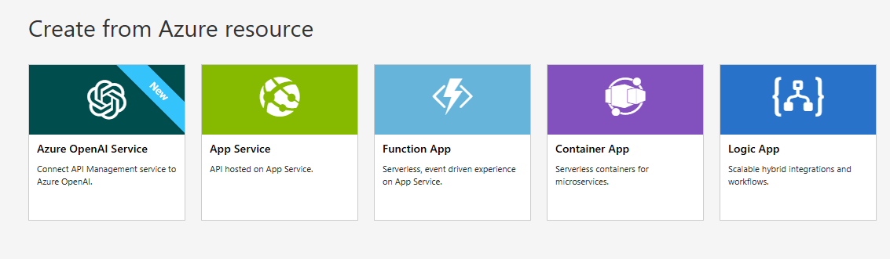
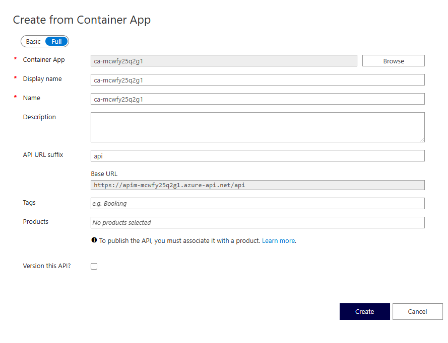
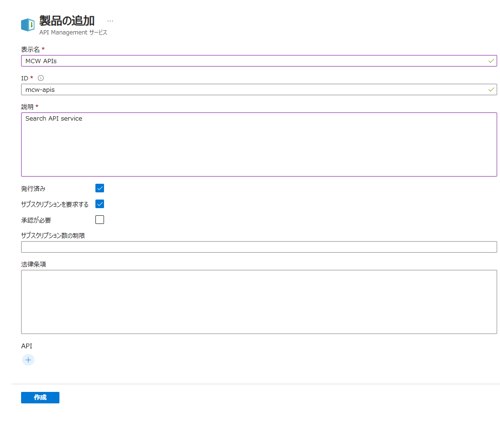
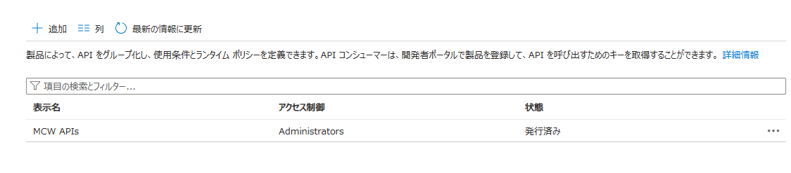
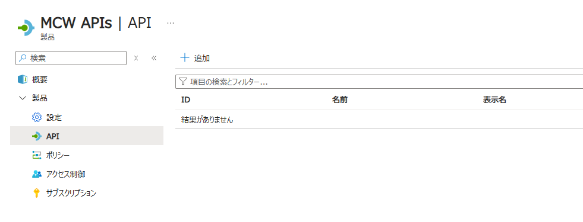
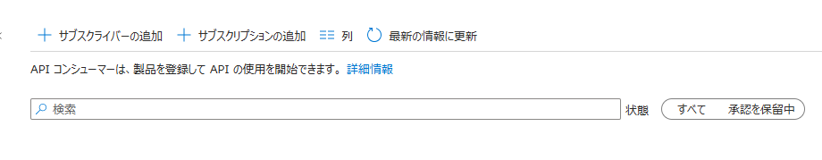
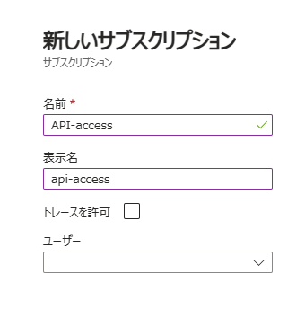

Retrieval Augmented Generation (RAG) pattern for Azure AI Search  
Dec 2024

 

### Contents

- [Exercise 8: API Management を使用した API の発行](#exercise-8-api-management-を使用した-api-の発行)

  - [Task 1: プライベート エンドポイントの作成](#task-1-プライベート-エンドポイントの作成)

  - [Task 2: API Management の展開](#task-2-api-management-の展開)

  - [Task 3: API Management インスタンスと仮想ネットワークの統合](#task-3-api-management-インスタンスと仮想ネットワークの統合)

  - [Task 4: API の公開](#task-4-api-の公開)

 

## Exercise 8: API Management を使用した API の発行

 

### Task 1: プライベート エンドポイントの作成

- Azure AI Search の **検索管理** > **ネットワーク** を選択

- **ファイアウォールと仮想ネットワーク** タブで **パブリック ネットワーク アクセス** を **無効** に変更

  > 「このサービスのエンドポイントを接続をプライベートにしますか？」のメッセージが表示されるので **はい** をクリック

- **保存** をクリック

  

- **プライベート エンドポイント接続** > **＋ プライベート エンドポイントを作成する** をクリック

  

- プライベート エンドポイントの作成

  - **基本**

    - **プロジェクトの詳細**

      - **サブスクリプション**: ワークショップで使用中のサブスクリプション

      - **リソース グループ**: Azure AI Search が属するリソース グループ

    - **インスタンスの詳細**

      - **名前**: 任意 (pep-AI-Search など)

      - **ネットワーク インターフェイス名**: 任意 (nic-AI-Search など)

      - **リージョン**: 展開先の仮想ネットワークと同じリージョン

        

  - **リソース**

    - **サブスクリプション**: ワークショップで使用中のサブスクリプション

    - **リソースの種類**: Microsoft.Search/searchServices

    - **リソース**: Azure AI Search

    - **対象サブリソース**: searchService

      

  - **仮想ネットワーク**

    - **仮想ネットワーク**: 展開先の仮想ネットワーク

    - **サブネット**: 展開先のサブネット

    - **IP アドレスを動的に割り当てる**: オン

      
  
  - **DNS**

    - **プライベート DNS ゾーンと統合する**: はい

      
  
  - **タグ**

    

- **作成** をクリック

  

- ストレージ アカウント (Blob), Azure OpenAI Service, Key Vault に対するプライベート エンドポイントを作成

  - **ストレージ アカウント (Blob)**

    - **リソースの種類**: Microsoft.Storage/storageAccounts

    - **対象サブリソース**: blob

      
  
  - **Azure OpenAI Service**

    - **リソースの種類**: Microsoft.CognitiveServices/storageAccounts

    - **対象サブリソース**: account

      
  
  - **Key Vault**

    - **リソースの種類**: Microsoft.KeyVault/vaults

    - **対象サブリソース**: vaults

      

 

### Task 2: API Management の展開

- [Azure Portal](https://portal.azure.com/) のホーム画面で **＋ リソースの作成** をクリック

- **カテゴリ** > **Web** を選択、**API Management** の **作成** をクリック

- Azure API Management サービスの作成

  - **基本**

    - **プロジェクトの詳細**

      - **サブスクリプション**: ワークショップで使用中のサブスクリプション

      - **リソース グループ**: リソース グループ

    - **インスタンスの詳細**

      - **リージョン**: 展開するリージョン

      - **リソース名**: 任意 (apim-xxxx など)

      - **組織名**: 任意 (MCW など)

      - **管理者のメールアドレス**: 任意

    - **価格レベル**

      - **価格レベル**: Standard v2

      - **ユニット**: 1

        

    - **監視とセキュリティ保護**

      - **Log Analytics**: オン

        - **サブスクリプション**: ワークショップで使用中のサブスクリプション

        - **ログ分析ワークスペース**: 事前に展開済みの Log Analytics ワークスペース
      
      - **Application Insights**: オン

        - **インスタンスの選択**: 事前に展開済みの Application Insights

          
    
    - **仮想ネットワーク**

      - **接続の種類**: なし

        
    
    - **マネージド ID**

      

      > 既定のまま、有効化は不要
    
    - **タグ**

      
  
- **作成** をクリックし API Management インスタンスを展開

  

 

### Task 3: API Management インスタンスと仮想ネットワークの統合

- 仮想ネットワークの **設定** > **サブネット** を選択、統合に使用するサブネットをクリック

  

- **サブネットをサービスに委任** に **Microsoft.Web/serverFarms** を選択し **保存** をクリック

  

- API Management の **Deployment + infrastructure** > **ネットワーク** を選択

- **VNET integration** をクリック

  

- **仮想ネットワーク** にチェックし、**VNET を選択してください** をクリック

  

- サービスを委任したサブネットを持つ仮想ネットワーク、およびサブネットを選択し **適用** をクリック

  

- **保存** をクリック

  

- **VNET intagration** が **On** に変更されたことを確認

  

 

### Task 4: API のインポートと発行

- API Management の **APIs** > **API** を選択

- **Create from Azure resource** > **Container App** をクリック

  

- **Full** を選択し、必要な情報を入力

  - **Container App**: **Browse** をクリックし、API を展開した Contaienr Apps を選択

  - **API URL suffix**: api

    

- **Create** をクリックし API をインポート

- **APIs** > **製品** を選択し **＋ 追加** をクリック

  - 製品の追加

    - **表示名**: MCW APIs (任意)

    - **ID**: mcw-apis (任意)

    - **説明**: Search API service (任意)

    - **発行済み**: オン

    - **サブスクリプションを要求する**: オン

      

- **作成** をクリックし、製品を追加

- 追加した製品をクリック

  

- **製品** > **API** を選択し **＋ 追加** をクリック、インポートした API を選択し **選択** をクリック

  

- **製品** > **サブスクリプション** を選択し **＋ サブスクリプションの追加** をクリック

  

- **名前**、**表示名** を入力し **作成** をクリック

  

- 追加したサブスクリプションの **...** をクリックし **キーの表示/非表示** をクリック

- API 応答のテストを行うために **主キー** をコピー

 

### 参考情報

- [Azure API Management とは](https://learn.microsoft.com/ja-jp/azure/api-management/api-management-key-concepts)

- [送信要求用の VNet との統合](https://learn.microsoft.com/ja-jp/azure/api-management/integrate-vnet-outbound)

- [Container Apps Web API のインポート](https://learn.microsoft.com/ja-jp/azure/api-management/import-container-app-with-oas)

- [最初の API のインポートと発行](https://learn.microsoft.com/ja-jp/azure/api-management/import-and-publish)

- [製品を作成して発行する](https://learn.microsoft.com/ja-jp/azure/api-management/api-management-howto-add-products?tabs=azure-portal&pivots=interactive)